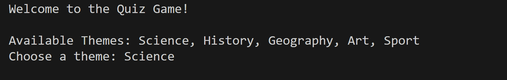
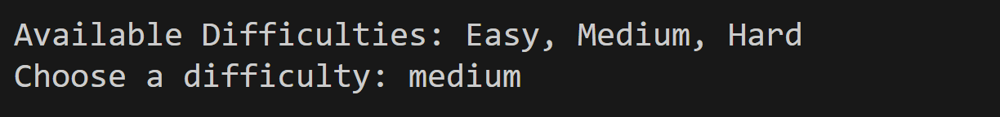

# -Quizz-Game---Claire---CDOF2-

## Table of Contents
- [Description](#description)
- [Features](#features)
- [Installing](#installing)
- [How to Play](#how-to-play)
- [Built with](#built-with)
- [Contributing](#contributing)
- [Authors](#authors)
- [License](#license)

## Description
Do you enjoy testing your knowledge across various topics? This Quiz Game challenges players with questions from categories like Science, History, and more! With three difficulty levels, there’s something for everyone – from beginners to trivia experts.

Can you answer questions like:
*"What planet is known as the Red Planet?"* or
*"In which year were the first modern Olympic Games held?"*

Sharpen your knowledge and compete for the highest score!

## Features
- Few themes available:
  - Science
  - History
  - Geography
  - Art
  - Sport
- Three difficulty levels:
  - Easy
  - Medium
  - Hard
- Scoring system

## Installing
1. Clone the repository:
  ```bash
   git clone https://github.com/clairecc94/-Quizz-Game---Claire---CDOF2-
   cd Quiz-Game
  ```
3. Run the Game:
```bash
   python main.py
```

## How to Play
1. When the game starts, choose a theme from the available options.

2. Select a difficulty level.

3. Answer the questions by entering the number corresponding to your choice.

4. See the answer and accumulate points.
5. Continue playing or exit the game at the end of each round.


## Build with
Python

## Contributing
Contributions are welcome to make the game even better! Here’s how:

1. Fork the repository.
2. Create a feature branch: git checkout -b feature/YourFeatureName.
3. Commit your changes: git commit -m 'Add your feature'.
4. Push to the branch: git push origin feature/YourFeatureName.
5. Open a pull request.

## Authors
clairecc94 - Initial work.

## License
This project is licensed under the MIT License 


